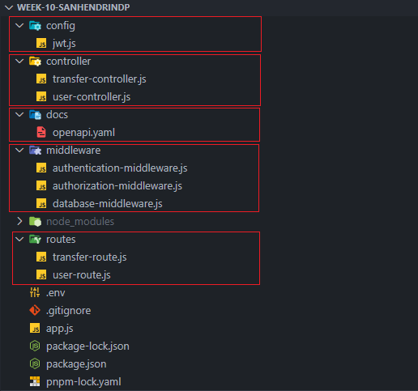

<h5 align="center">Created by Using</h5>

    </a> 

<h5 align="center">Link Project</h5>

<a href="https://week-10-sanhendrindp-production.up.railway.app/">week-10-sanhendrindp-production.up.railway.app/</a>

# Project Description

In this week 10 project, we built a RESTful API server using the MongoDB database. This app, later on, can do basic registration for new users and login. Users must have an account by registering and then login. And users will have a role, which is maker and approver. Maker can create a transfer request, but that request will be in pending status first. Then approver can change that status transfer to approved or not approved.

# Folders Structure

Here, i will try to explain the structure of important folders for this project by using the image below.

 

1. Middleware: This folder serves to store middlewares for this project. It contains 3 files:
   - database-middleware.js : Connection to MongoDB database (linked to Railway).
   - authentication-middleware.js : To authenticate transfer requests by using JWT token. Creating a transfer and getting all transfers will need a token that is obtained when the user login.
   - authorization-middleware : To authorize based on users role, maker or approver.
2. Routes: This folder serves to set the route for users and transfers, contains 2 files:
   - user-route.js : For login and users register.
   - transfer-route.js : For transfer route.
3. Controller: This folder contains logic code for folder routes. It contains 2 files:
   - user-controller.js : Logic code for user-route.js
   - transfer-controller.js : Logic code for transfer-route.js
4. Config: Contain jwt.js to configure JWT token signature.
5. Docs: Contain openapi.yaml for API documentation which can be run by using Swagger.

# Testing on Postman

---

Thank you 🙏

